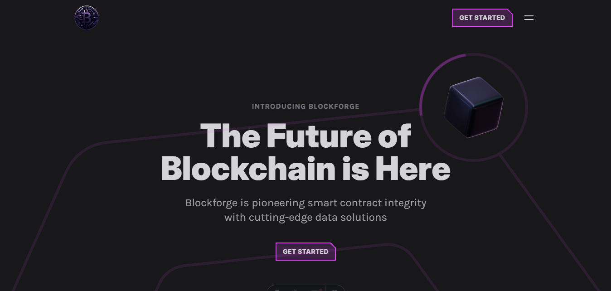
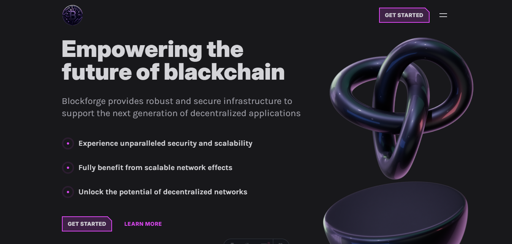
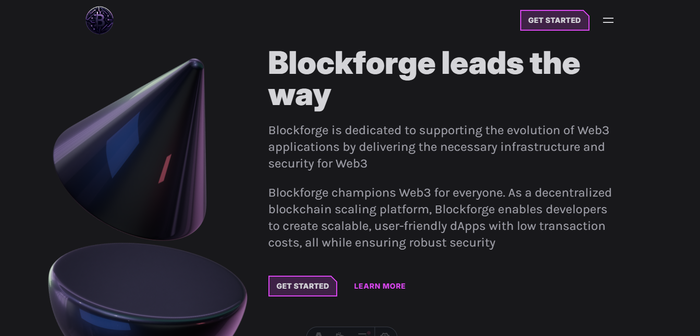
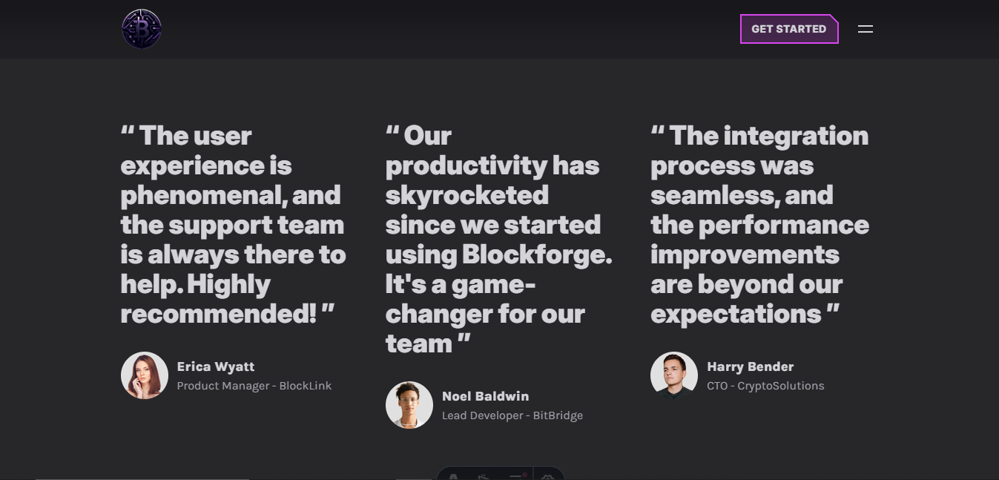
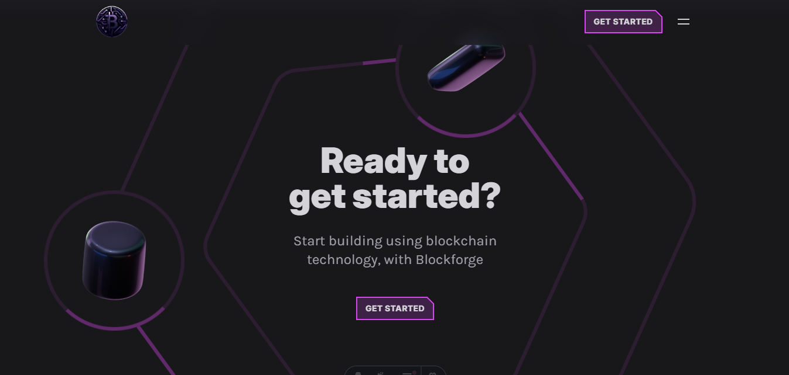

# About the App 

This is a modern [Blockchain Site](https://blockchain-site.pages.dev/) called Blockforge built by `Diego Tech` by using:

- Astro.js
- React.js
- TypeScript

<br />









<br />

## Libraries that I used for the App 🚀

- Tailwindcss
- Tailwind Merge
- Tailwindcss Typography
- Framer Motion
- Prettier

<br />

### One Message for EveryOne 🔥

> [!TIP]
> ```shell
> Aguante Argentina!!!
> Aguante Messi!!!
> ```